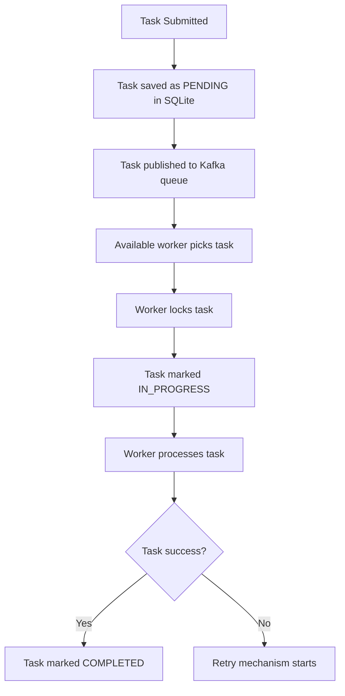
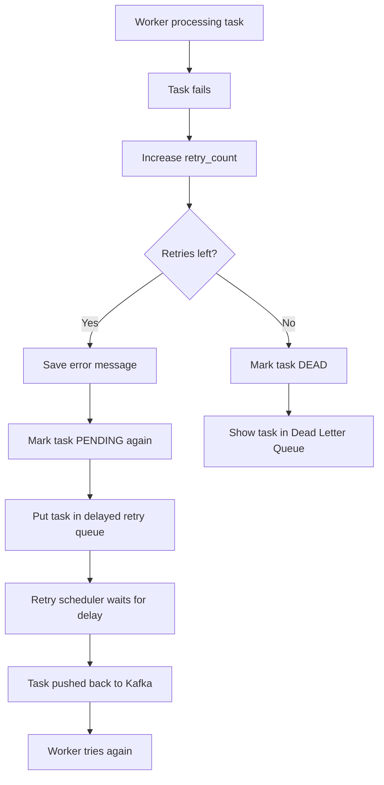
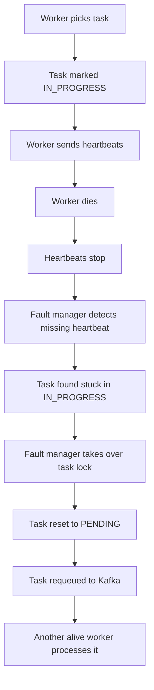
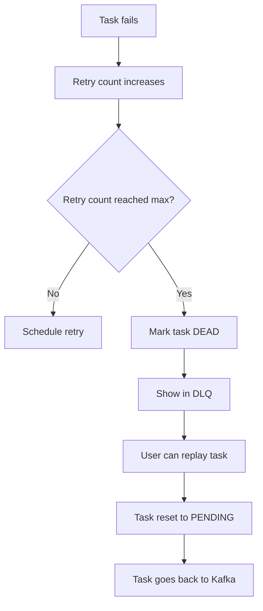

# Distributed Queue System - Simple Flow

This file explains only the core working of the project:

- Distributed queue flow
- Retry mechanism
- Fault tolerance

No extra theory. No application-level architecture.

## 1. Distributed Queue Flow

This is the normal path when everything is working.

### What Happens

1. A task is submitted through the API or dashboard.
2. The task is first saved in SQLite with status `PENDING`.
3. The task is pushed to Kafka.
4. Kafka keeps the task until a worker consumes it.
5. One worker picks the task.
6. The worker takes a lock so another worker does not process the same task.
7. The task becomes `IN_PROGRESS`.
8. If processing succeeds, the task becomes `COMPLETED`.

### Why This Is Distributed

- The API and workers are separate processes.
- Multiple workers can run at the same time.
- Kafka distributes tasks among workers.
- SQLite keeps the task state even if the app refreshes or a worker dies.

## 2. Retry Mechanism Flow

Retry happens when the **worker is alive**, but the **task fails**.

Example: external API timeout, bad response, network error, or simulated task failure.

### What Happens

1. Worker starts processing a task.
2. The task fails.
3. `retry_count` is increased.
4. The error is saved in SQLite.
5. If retries are still left, the task is marked `PENDING`.
6. The task is placed into a delayed retry queue.
7. The retry delay uses exponential backoff.
8. The retry scheduler later pushes the task back to Kafka.
9. Another worker, or the same worker, can try it again.
10. If retries are exhausted, the task becomes `DEAD`.
11. `DEAD` tasks appear in the Dead Letter Queue.

### Important Point

Retry does **not** mean the worker died.

Retry means:

> The worker is running, but the task failed.

## 3. Fault Tolerance Flow

Fault tolerance happens when the **worker process dies** while a task is running.

Example: worker crash, forced crash simulation, process killed, machine failure.

### What Happens

1. Worker picks a task.
2. Task becomes `IN_PROGRESS`.
3. Worker keeps sending heartbeats.
4. If the worker dies, heartbeats stop.
5. Fault manager notices the missing heartbeat.
6. Fault manager checks which task was stuck with that dead worker.
7. The stuck task is reset to `PENDING`.
8. The task is requeued to Kafka.
9. Another alive worker can process it.

### Important Point

Fault tolerance does **not** mean the failed worker is automatically restarted.

Fault tolerance means:

> The task is not lost when the worker dies.

## Retry vs Fault Tolerance

| Case              | Worker Alive? |        Task Failed? | What Happens                |
| ----------------- | ------------: | ------------------: | --------------------------- |
| Retry             |           Yes |                 Yes | Task is retried after delay |
| Fault tolerance   |            No |             Unknown | Stuck task is requeued      |
| Dead Letter Queue |           Yes | Yes, too many times | Task becomes `DEAD`       |

## Dead Letter Queue Flow

### What Happens

1. A task keeps failing.
2. Each failure increases `retry_count`.
3. When `retry_count` reaches `max_retries`, the task becomes `DEAD`.
4. The task appears in the DLQ.
5. The user can replay it manually.
6. Replay resets it to `PENDING` and pushes it back to Kafka.

## Short Demo Explanation

Use this exact explanation:

> In our project, Kafka is the distributed queue. The API submits tasks to Kafka, and multiple workers consume them. If a task fails but the worker is alive, the retry mechanism schedules it again with backoff. If a worker dies while processing a task, the fault manager detects the missing heartbeat and requeues the stuck task. If a task fails too many times, it goes to the Dead Letter Queue, where we can inspect and replay it.

## Final One-Line Summary

> Retry handles task failure. Fault tolerance handles worker failure. DLQ stores tasks that failed too many times.
